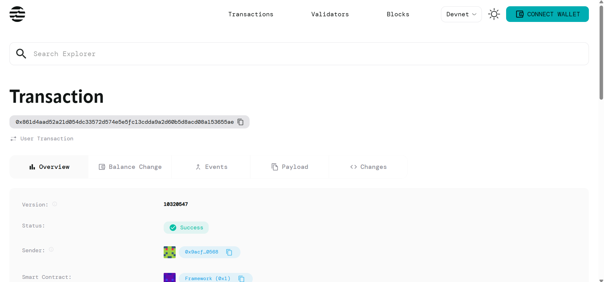

# NFT Bundle Contract

## Project Title
NFT Bundle Trading System

## Project Description
The NFT Bundle Contract is a smart contract built on the Aptos blockchain that enables users to create, manage, and trade collections of NFTs as unified bundles. This system allows NFT collectors and traders to package multiple NFTs together and sell them as a single unit, providing a more efficient way to trade collections of related digital assets.

The contract facilitates the creation of NFT bundles where users can combine multiple NFT token IDs into a single tradeable package with a set price. Buyers can then purchase entire bundles in one transaction, streamlining the process of acquiring multiple NFTs simultaneously.

## Project Vision
Our vision is to revolutionize the NFT marketplace by introducing bundle trading capabilities that:
- Simplify the process of trading multiple NFTs
- Enable collectors to curate and sell themed collections
- Reduce transaction costs by bundling multiple assets
- Create new opportunities for NFT portfolio management
- Foster a more dynamic and flexible NFT ecosystem

We aim to become the leading platform for NFT bundle trading, making it easier for creators, collectors, and traders to manage and exchange digital asset collections efficiently.

## Key Features

### 🎯 Bundle Creation
- Create custom NFT bundles by combining multiple NFT token IDs
- Set custom pricing for entire bundle packages
- Flexible bundle composition with any number of NFTs

### 💰 Seamless Trading
- One-click bundle purchasing with AptosCoin
- Automatic ownership transfer upon successful purchase
- Built-in payment verification and security checks

### 🔒 Security & Ownership
- Secure ownership tracking for each bundle
- Immutable bundle composition once created
- Transparent pricing and availability status

### ⚡ Efficient Transactions
- Reduced gas fees compared to individual NFT purchases
- Single transaction for multiple NFT acquisitions
- Streamlined bundle management system

### 🌐 Aptos Integration
- Built on high-performance Aptos blockchain
- Leverages Aptos Framework for reliable operations
- Native AptosCoin payment integration

## Future Scope

### Phase 1: Enhanced Bundle Management
- Add functionality to modify bundle contents
- Implement bundle listing and delisting features
- Create bundle browsing and discovery mechanisms

### Phase 2: Advanced Trading Features
- Auction-style bundle trading
- Time-limited offers and flash sales
- Bundle swapping between users
- Fractional bundle ownership

### Phase 3: Marketplace Integration
- Full-featured NFT bundle marketplace UI
- Advanced search and filtering options
- Bundle analytics and pricing insights
- Integration with existing NFT platforms

### Phase 4: Community Features
- Bundle collections and curated galleries
- Community voting on featured bundles
- Creator royalties for original bundle creators
- Social features and bundle sharing

### Phase 5: Cross-Chain Compatibility
- Bridge functionality for multi-chain NFT bundles
- Integration with other blockchain networks
- Universal bundle standards development

## Contract Details
0x861d4aad52a21d054dc33572d574e5e5fc13cdda9a2d60b5d8acd08a153655ae

